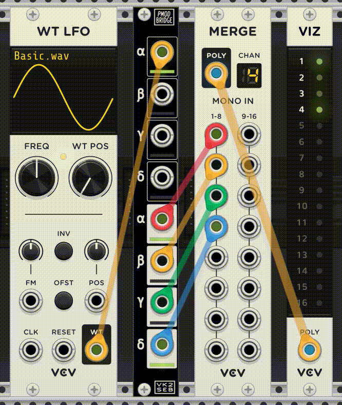

# Basic example of simulating Verilog inside a VCV Rack plugin.

This plugin simulates the panel layout of the [`eurorack-pmod`](https://github.com/schnommus/eurorack-pmod) FPGA-based module. See [`rtl/core.sv`](rtl/core.sv) for the Verilog source. This example is intentionally kept as simple as possible.



# Dependencies

1. Install VCV rack binaries or build it from source.
2. Install [VCV rack SDK](https://vcvrack.com/manual/PluginDevelopmentTutorial) (or just put this folder in the plugins/ directory of Rack if you are building from source)
3. Install Verilator (used to build a C++ simulation from the Verilog core). You can either get it from your package manager or use the one included in the [oss-cad-suite](https://github.com/YosysHQ/oss-cad-suite-build#installation).

# Building and running

If you are using the SDK, make sure you have `RACK_DIR` set:

```
export RACK_DIR=<Rack SDK folder>
```

From the root directory of this repository:

```
$ make
$ make install
```

This plugin should now be visible on restarting VCV Rack.

# Limitations

At the moment only the audio rate `sample_clk` is injected into the verilog core, I doubt verilator would be fast enough to simulate filters pipelined at the PLL clock (12MHz/24MHz).

# Debugging

Some basic CI for Mac + Linux is in [`.github/workflows/main.yml`](.github/workflows/main.yml), this may be useful to look at if you are having trouble building.

Sometimes it is useful to run VCVRack in development mode so that you get some more detailed logs if a plugin doesn't load correctly:

```bash
$ ./Rack --dev
```

For example, an update to verilator recently added an extra source dependency that was missing, causing an error like this --


```bash
[0.011 info src/plugin.cpp:130 loadPlugin] Loading plugin from /home/seb/Downloads/Rack2Free/plugins/eurorack-pmod-vcvrack
[0.011 warn src/plugin.cpp:196 loadPlugin] Could not load plugin /home/seb/Downloads/Rack2Free/plugins/eurorack-pmod-vcvrack: Failed to load library /home/seb/Downloads/Rack2Free/plugins/eurorack-pmod-vcvrack/plugin.so: /home/seb/Downloads/Rack2Free/plugins/eurorack-pmod-vcvrack/plugin.so: undefined symbol: _ZN12VlThreadPoolC1EP16VerilatedContextj
```
